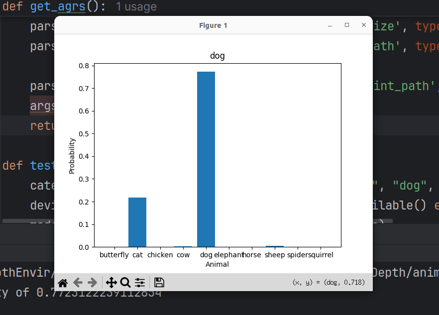
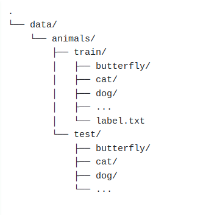

# Introducttion
The project used CNN for detect animals.
 

 
### Data structure
You should organize your data structure similar to the one below.
  

### How to run
Prepare a picture you want
1. Clone the repository `https://github.com/maixuanthuan/Animal_Prediction.git`
2. Run `pip install -r requirements.txt` to install packages required
3. Run `python animals_test.py <args>` to predict your picture
  
4. Example: python animals_test.py --image_path test.jpeg

   

